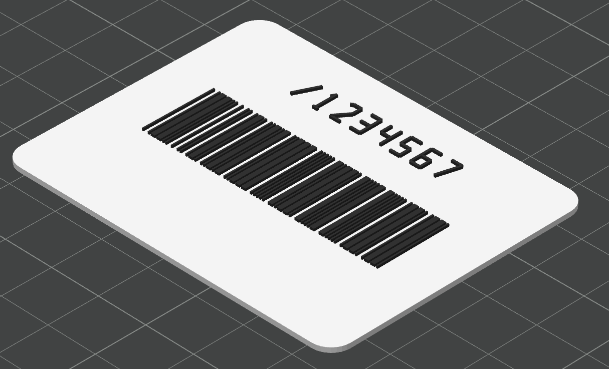

# 3D Barcode Carrier Converter

A browser-based 3D printable barcode carrier card generator for STL and 3MF export.

## Features

- Generate a printable carrier card from barcode text.
- Supports Code 39 for Taiwan carrier-style barcodes and Code 128 for general text.
- Export combined STL, multi-part 3MF, and SVG preview files.
- Adjustable card size, barcode area, corner radius, base thickness, and raised barcode height.
- Optional carrier number text on the card.

## Usage

Open `index.html` in a browser, enter the barcode content, adjust the print settings, then download STL or 3MF.

- Without AMS: download STL and assign colors manually in the slicer if needed.
- With AMS: download 3MF and customize object colors in Bambu Studio.

Always test-scan the printed barcode before daily use.
